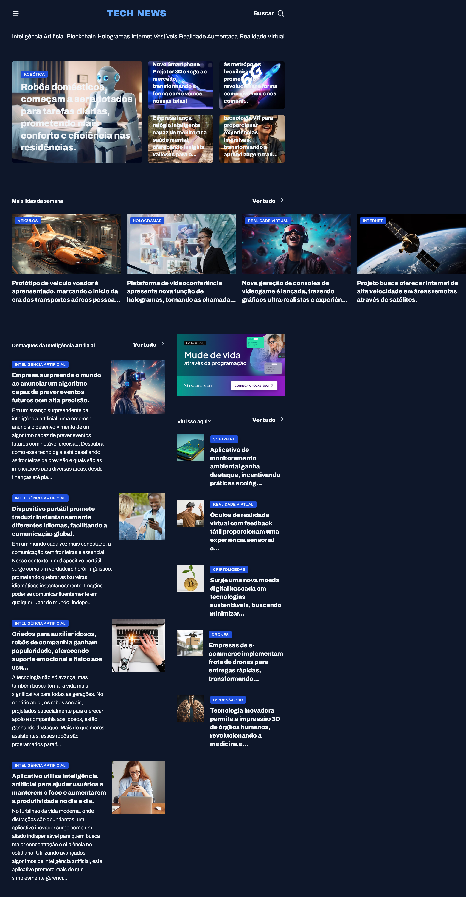

<div align="center">

# 📰 Tech News Portal

A responsive technology news portal built with **HTML5** and **CSS3**, featuring a modern editorial layout inspired by digital news websites.

This project was developed during the **Full-Stack Development** program by **Rocketseat**, focusing on responsive design, CSS Grid layouts, semantic HTML, and user interface composition. :contentReference[oaicite:0]{index=0}

<p>


</p>

</div>

---

# 📸 Preview

<p align="center">

</p>

> Save this screenshot as **preview.png** inside the **assets** folder.

---

# ✨ Features

- 📰 Modern news portal layout
- 📱 Fully responsive interface
- 🧩 Complex layout built with CSS Grid
- 🗂️ Multiple news categories
- 🔍 Search section
- 📸 Featured news highlights
- 📚 Editorial sections with different content blocks
- 🎨 Clean and organized visual hierarchy

---

# 🛠️ Technologies

- HTML5
- CSS3
- CSS Grid
- Flexbox

---

# 🎯 Project Goals

The main objective of this project was to strengthen Front-End development skills by building a realistic news portal interface.

Throughout the project, I practiced:

- Semantic HTML
- CSS Grid
- Flexbox
- Responsive Design
- Layout composition
- Typography
- Spacing
- Image positioning
- Visual hierarchy
- Clean and maintainable code

---

# 📂 Project Structure

```text
📦 portal-de-noticias
├── assets/
│   ├── preview.png
│   ├── icons/
│   ├── images/
│   └── logo.svg
├── index.html
├── style.css
└── README.md
```

---

# 🚀 Getting Started

Clone the repository:

```bash
git clone https://github.com/mussatograziela/portal-de-noticias.git
```

Open the project folder:

```bash
cd portal-de-noticias
```

Run the project by opening **index.html** in your browser or using the **Live Server** extension in Visual Studio Code.

---

# 📚 What I Learned

This project allowed me to improve my understanding of:

- Semantic HTML5
- CSS Grid
- Flexbox
- Responsive Web Design
- Editorial page layouts
- Image organization
- Component composition
- Modern Front-End development practices

---

# 🔮 Future Improvements

- [ ] Add Dark Mode.
- [ ] Implement a functional search feature.
- [ ] Load news dynamically from an API.
- [ ] Add category filters.
- [ ] Create article detail pages.
- [ ] Improve accessibility (WCAG).
- [ ] Add smooth animations and transitions.

---

# 👩‍💻 Author

<div align="center">

## **Graziela Jordana Mussato**

**Front-End Developer**

Passionate about building modern, responsive, and accessible web interfaces while continuously improving my Front-End development skills.

<p>

<a href="https://github.com/mussatograziela">

</a>

<a href="https://www.linkedin.com/in/graziela-mussato">

</a>

</p>

</div>

---

<div align="center">

⭐ If you found this project interesting, consider giving it a star!

</div>
